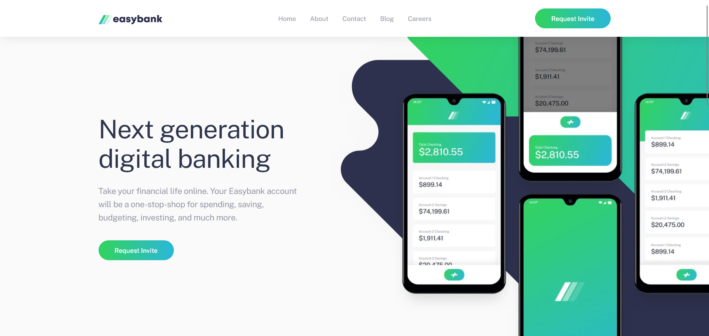
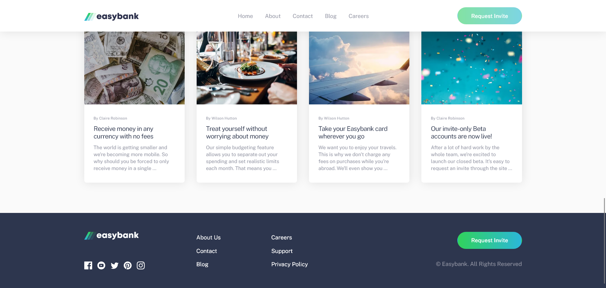
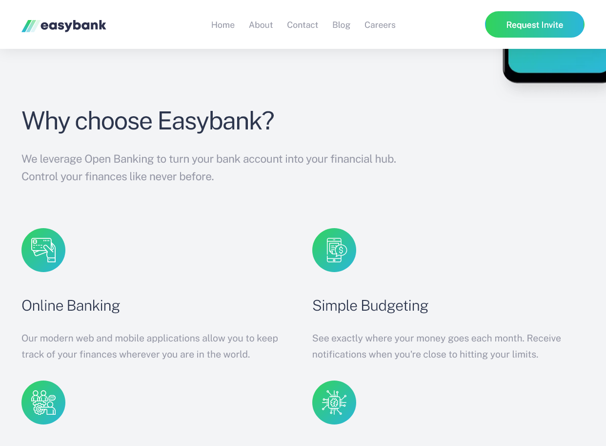
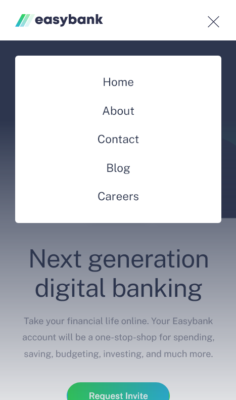
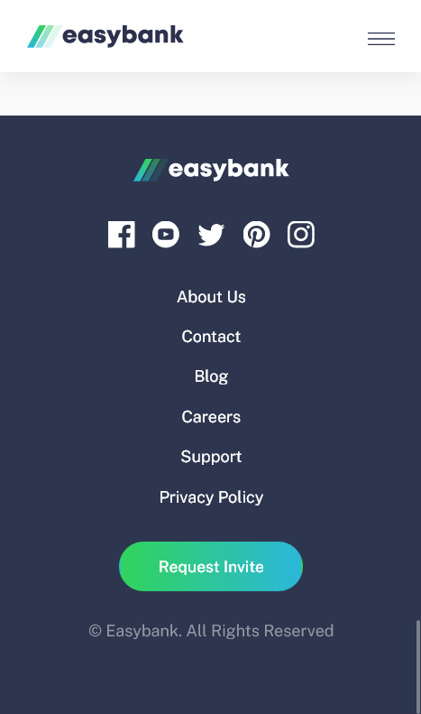

# Frontend Mentor - Easybank landing page solution

This is a solution to the [Easybank landing page challenge on Frontend Mentor](https://www.frontendmentor.io/challenges/easybank-landing-page-WaUhkoDN). Frontend Mentor challenges help you improve your coding skills by building realistic projects.

## Table of contents

- [Overview](#overview)
  - [The challenge](#the-challenge)
  - [Screenshot](#screenshot)
  - [Links](#links)
- [My process](#my-process)
  - [Built with](#built-with)
  - [What I learned](#what-i-learned)
  - [Useful resources](#useful-resources)
- [Author](#author)
- [Acknowledgments](#acknowledgments)

## Overview

### The Challenge

- [X] View the optimal layout for the site depending on their device's screen size
- [X] See hover states for all interactive elements on the page

### Screenshot

#### Desktop

#### Tablet

#### Mobile

### Links

- Live Site URL: [https://easybank-landing-page-master-beta-six.vercel.app/](https://easybank-landing-page-master-beta-six.vercel.app/)
- Repository URL: [https://github.com/cholis04/easybank-landing-page-master](https://github.com/cholis04/easybank-landing-page-master)

## My process

In this challenge, I want to focus on improving page layouts with good structure which will indirectly improve page accessibility.

### Built with

I'm just using a simple setup, but I need to make sure that my code runs correctly in all web browsers. Here's the technology I use:

- HTML5
- [Sass](https://sass-lang.com/) - (CSS preprocessor)
- [Typescript](https://www.typescriptlang.org/) - (JavaScript with syntax for types)
- [Parcel](https://parceljs.org/) - (Build tool for web)

From this technology, it allows me to develop simple sites written such as HTML, CSS and Javascript with minimal configuration thanks to Parcel which has taken care of it.

### What I Learned

1. Improved ability to specify tags on **page layout** for designs to be worked on.
2. Understand the use of semantic tags for **accessibility**.

### Useful resources

- [https://www.a11ymatters.com/pattern/mobile-nav/](https://www.a11ymatters.com/pattern/mobile-nav/)
- [https://www.w3.org/WAI/ARIA/apg/example-index/landmarks/HTML5.html](https://www.w3.org/WAI/ARIA/apg/example-index/landmarks/HTML5.html)
- [https://docs.emmet.io/cheat-sheet/](https://docs.emmet.io/cheat-sheet/)

## Author

- Website - [https://cholis04.github.io](https://cholis04.github.io)
- Frontend Mentor - [@cholis04](https://www.frontendmentor.io/profile/cholis04)
- Dribbble - [cholis04](https://dribbble.com/cholis04)
- Instagram - [@cholis04](https://instagram.com/cholis04)
- Codepen - [cholis04](https://codepen.io/cholis04)

## Acknowledgments

Many thanks to anyone who provided feedback.
